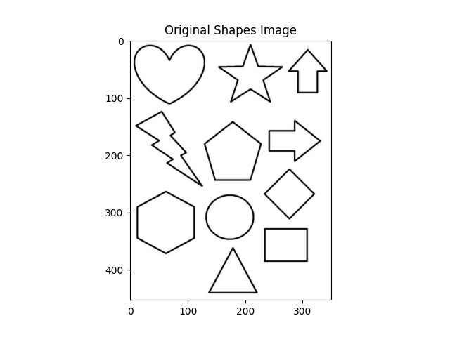
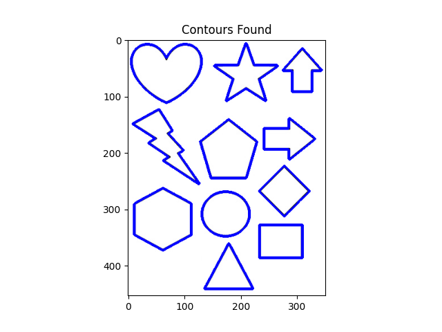
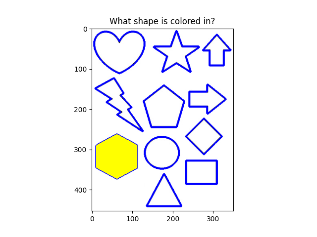
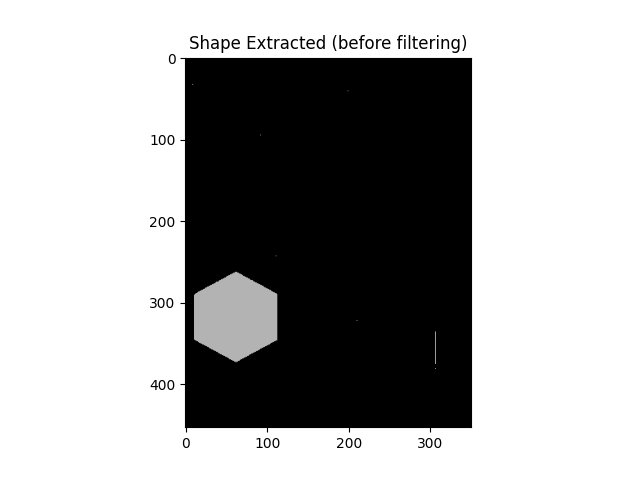
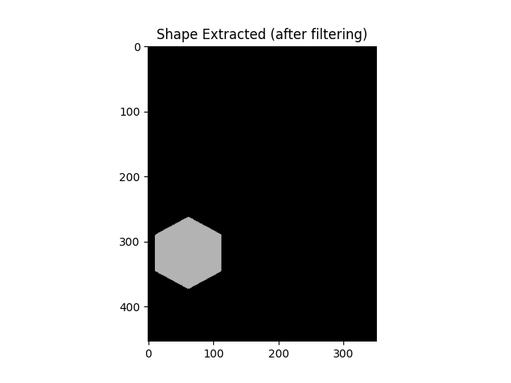
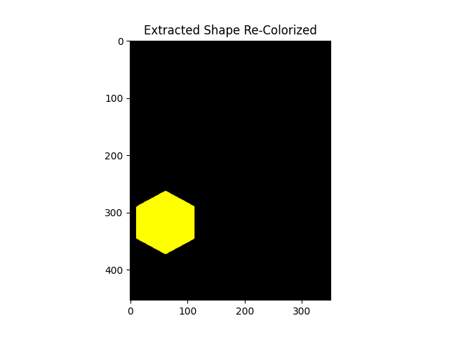

# Basic Shape Detection  

**Final project CS-3150, Image Processing & Computer Vision, Fall 2020, Dr. Feng Jiang**    

Python: 3.7.0  
OpenCV: 4.4.0  
Numpy:  1.19.2  
Matplotlib: 3.3.1   

**Execute**  
`python3 final.py`  

**Single shape is selected (colored-in), others are filtered out, shape is cleaned up & re-colored**

  

  

  

  

  

  

## References: 

* **OpenCV functions: threshold, find/draw contour**
  * https://docs.opencv.org/2.4/modules/imgproc/doc/structural_analysis_and_shape_descriptors.html?highlight=approxpolydp)  
  
* **Additional OpenCV Reference:**  
  * https://docs.opencv.org/4.1.0/d3/dc0/group__imgproc__shape.html#ga0012a5fdaea70b8a9970165d98722b4c  
  
* **Douglas-Peucker algorithm (potential “game-play”, not used in submission but in code).**  
  * https://en.wikipedia.org/wiki/Ramer%E2%80%93Douglas%E2%80%93Peucker_algorithm  
  
* **Median Filter Implementation, provided by, Dr. Feng Jiang, Demo5_2dFilters.py, CS-3150, Image Processing & Computer Vision, Fall 2020**  
  
* **“Simple Shape Detection”  for Game Implementation (contour concepts in project).**  
  * https://www.youtube.com/watch?v=mVWQNeY1Pb4  
  
* **Test Images**  
  * https://www.bestcoloringpagesforkids.com/shapes-coloring-pages.html

  
  
